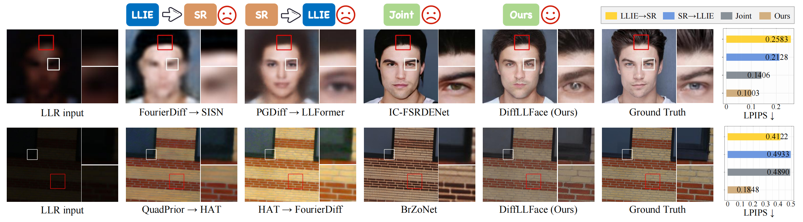
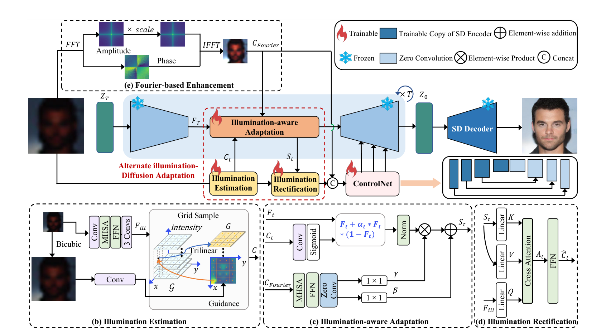

# DiffLLFace

Official implementation for **DiffLLFace: Learning Alternate Illumination-Diffusion Adaptation for Low-Light Face Super-Resolution and Beyond**.


## 📰 News
- **🔥🔥🔥2026.03.06**: Training code is now available.
- **🔥🔥🔥2026.03.05**: Testing code and pre-trained models have been released.
- **🔥🔥🔥2026.02.28**: The DiffLLFace paper was accepted by **IEEE TIP**.

## 📝 Abstract



Facial image acquisition under constrained illumination and with limited-resolution imaging devices often results in coupled photometric and geometric degradations, manifesting as low-light and low-resolution (LLR) conditions. Prevailing research predominantly follows fragmented optimization paradigms that address low-light image enhancement (LLIE) and face super-resolution (FSR) as isolated tasks. This approach overlooks the compound nature of the degradations, thereby significantly limiting their applicability in practical scenarios. To bridge this gap, we present DiffLLFace, a unified framework that harnesses diffusive generative capabilities with illumination-aware trajectories to achieve robust FSR from LLR observations. The core of our method lies in its alternate illumination-diffusion adaptation, which operates throughout the generation process. This mechanism not only captures degradation patterns in both brightness and structure to harmonize latent representations but also dynamically calibrates the illumination prior with the generative knowledge inherent to diffusion models. As such, DiffLLFace attains precise control over conditional adaptation and illumination rectification. We further devise a simple yet effective non-parametric Fourier enhancement strategy, which provides structural appearance clues that work in concert with the alternate adaptation to ensure texture and color consistency. Extensive experiments demonstrate the superiority of DiffLLFace over existing methods and remarkable generalizability on complex natural scenes.

## 🔧 Pipeline



## 🧪 Environment

- Create a clean Conda environment:
```bash
conda create -n DiffLLFace python=3.8.20 pip=24.0 -y
```

- Activate the environment:
```bash
conda activate DiffLLFace
```

- Install PyTorch with CUDA 11.8:
```bash
pip install torch==2.0.0+cu118 torchaudio==2.0.1+cu118 torchvision==0.15.1+cu118 -f https://download.pytorch.org/whl/cu118/torch_stable.html
```

- Install other project dependencies:
```bash
pip install -r requirements.txt
```

## 🗂️ Dataset

Expected layout:

```text
dataset/
  CelebA/
    train/
      HR/
      LLR_x16/
    test/
      LLR_x16/
```
- CelebAMask-HQ **[[Baidu Drive]](https://pan.baidu.com/s/11H8F7q1H6AZlL-iNNGQvzQ?pwd=ksks)**.
- Training uses paired images from `dataset/CelebA/train/HR` and `dataset/CelebA/train/LLR_x16` (same filenames after sorting).
- Testing reads low-light LR images from `dataset/CelebA/test/LLR_x16`.


## 📄 Pre-trained Models

We provide the pre-trained models:

- CelebAMask-HQ **[[Baidu Drive]](https://pan.baidu.com/s/1bthLSIJLZenL4QenSQsICw?pwd=ksks)**.
  Place it in `./checkpoints/`.
- ControlNet **[[Baidu Drive]](https://pan.baidu.com/s/1LSx0An5kCzBGLAKrwkkscg?pwd=ksks)**.
  Place it in `./models/`.

## 🚀 Train

Before training, edit these variables in `train.py`:

- `GT_images`: glob path for GT/HR training images
- `LLR_images`: glob path for low-light LR training images
- `name`: experiment/checkpoint name prefix

Run training:

```bash
python train.py
```

Checkpoints are saved to `checkpoints/`.

## 🔍 Test

Key arguments in `test.py`:

- `--checkpoint`: path to model checkpoint file
- `--same_folder`: output directory for restored results
- `--input_folder`: input directory containing test images

Run inference:

```bash
python test.py
```
